# HX Infrastructure Ansible Repository

This repository manages the infrastructure automation for the HX platform using Ansible. It includes secure role-based deployments, centralized secrets management, and robust service configuration for a multi-host environment.

---

## Repository Structure

```mermaid
flowchart TD
    A[ansible.cfg] -->|Configures| B[site.yml]
    B -->|Includes| C[roles]
    C --> C1[hx_ca_trust]
    C --> C2[hx_domain_join]
    C --> C3[hx_pg_auth]
    C --> C4[hx_webui_install]
    A --> D[inventories]
    D --> D1[dev.ini]
    D --> D2[group_vars]
    D2 --> D3[all/vault.yml]
    D2 --> D4[all/main.yml]
    D2 --> D5[all/webui_api_token.yml]
    A --> E[playbooks]
    E --> E1[add_pg_repo.yml]
    E --> E2[cert_health.yml]
    E --> E3[deploy_ca_trust.yml]
    E --> E4[members_sanity.yml]
    E --> E5[netplan_standardize.yml]
    E --> E6[pg_auth_enforce.yml]
    E --> E7[remediate_domain_join.yml]
    E --> E8[smoke_critical.yml]
    E --> E9[smoke_pg.yml]
    E --> E10[webui_bootstrap_admin.yml]
    E --> E11[webui_enforce.yml]
    C1 -->|Defaults, Handlers, Tasks, Files| F1
    C2 -->|Defaults, Tasks| F2
    C3 -->|Defaults, Handlers, Tasks, Templates| F3
    C4 -->|Handlers, Tasks, Templates| F4
    E --> E12[templates]
    A --> G[docs]
    G --> G1[connection_contracts.md]
    G --> G2[secrets.md]
    G --> G3[vault_policy.md]
    G --> G4[README.md]
    A --> H[scripts]
    H --> H1[bootstrap]
    H1 --> H2[hx-csr.sh]
    H1 --> H3[hx-join.sh]
    H1 --> H4[hx-tls-deploy.sh]
```



---

## Key Components

### 1. Ansible Roles

- **hx_ca_trust**: Deploys and manages the HX root CA certificate across hosts.
- **hx_domain_join**: Handles domain join operations for servers, including Kerberos and SSSD setup.
- **hx_pg_auth**: Enforces PostgreSQL authentication and TLS policies, manages `pg_hba.conf` and related settings.
- **hx_webui_install**: Installs and configures the Open WebUI service, including secure script handling and systemd integration.

### 2. Playbooks

- **site.yml**: Entry point for orchestrating role execution.
- **smoke_pg.yml, webui_enforce.yml, cert_health.yml, etc.**: Specialized playbooks for validation, enforcement, and health checks.

### 3. Inventories & Group Vars

- **inventories/dev.ini**: Host inventory for the dev environment.
- **group_vars/all/vault.yml**: Centralized, encrypted secrets (Ansible Vault).
- **group_vars/all/main.yml**: Shared configuration variables.

### 4. Templates & Scripts

- **Systemd and env templates**: Jinja2 templates for service configuration.
- **Bootstrap scripts**: Shell scripts for initial server setup and certificate requests.

### 5. Documentation

- **docs/connection_contracts.md**: Canonical service endpoints and connection policies.
- **docs/secrets.md**: Registry of all secrets managed in the vault.
- **docs/vault_policy.md**: Policy for secrets management and rotation.

---

## Security & Best Practices

- **All secrets are managed via Ansible Vault** (`group_vars/all/vault.yml`). No plaintext secrets in the repo.
- **Idempotent role design**: All tasks are safe to re-run and converge to the desired state.
- **Systemd service validation**: Templates include robust checks for configuration correctness.
- **No insecure script execution**: All scripts are validated and checksummed before execution.

---

## Getting Started

1. **Clone the repository**
2. **Install Ansible** (>=2.10)
3. **Configure your vault password**
4. **Run a playbook**:

    ```bash
    ansible-playbook -i inventories/dev.ini site.yml --ask-vault-pass
    ```

---

## Mermaid Diagrams

- **Repo Structure**: See above for a visual map of the repository.
- **Service Architecture**: (Add additional diagrams as needed for network/service flows.)

---

## License

MIT License
